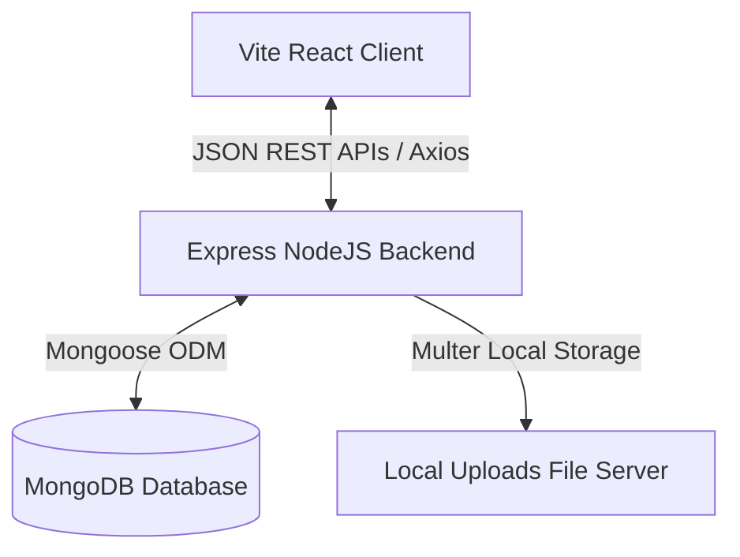

# ShopEZ E-Commerce Platform

ShopEZ is a clean, full-featured online marketplace built using the MERN stack (MongoDB, Express, React, Node) styled with a modern, beginner-friendly **white and blue UI**.

The platform supports two distinct user profiles: **Buyers** (who browse listings, review products, manage shopping carts, and check out securely) and **Sellers** (who access dashboard analytics, view monthly earning charts, manage order logs, and manage their listings catalog).

---

## ✨ Key Features

### 🛒 Buyer Features
- **Product Discovery**: Browse all products or filter them dynamically by categories, search keywords, and price ranges.
- **Cart Management**: Add/remove products and adjust item quantities with live cart total recalculations.
- **Secure Checkout**: Simple address form validation and order submission with automated stock decrementing.
- **Order Tracking**: Keep track of previous purchases and view real-time shipping/fulfillment status.
- **Product Reviews**: Submit ratings (1 to 5 stars) and comments on products.

### 📈 Seller Features
- **Catalog Manager**: Full CRUD operations to add, view, edit, and delete product listings.
- **Fulfillment Management**: View orders placed for catalog listings and update shipping logs (Pending ➜ Processing ➜ Shipped ➜ Delivered).
- **Earnings Analytics**: Visualized revenue charts (using Recharts) and monthly earning analytics.
- **Product Image Uploads**: Upload product photos seamlessly via local server uploads.

---

## 🛠️ Tech Stack

- **Frontend**:
  - **React.js (Vite)**: Clean single-page application builder.
  - **Redux Toolkit**: Centralized global client state (authentication, shopping cart, products, orders).
  - **Tailwind CSS**: Modern utility-first CSS styling.
  - **Recharts**: Responsive chart visualizations for the seller dashboard.
  - **Lucide React**: Clean SVG line iconography.
  - **Axios**: HTTP communication layer with automatic token interceptors.
- **Backend**:
  - **Node.js & Express.js**: Lightweight RESTful API routing and handling.
  - **JWT (JSON Web Tokens)**: Secure stateless authentication.
  - **bcryptjs**: Secure password hashing.
  - **Multer**: local file upload handling middleware.
- **Database**:
  - **MongoDB**: Flexible NoSQL document database.
  - **Mongoose**: Schemas and ODM utility layer.

---

## 📐 System Architecture

ShopEZ is built on a decoupled **Client-Server Architecture** communicating via JSON REST APIs:



### 1. Presentation Layer (Client)
- Static client served on port `3000`.
- Implements SPA routing with **React Router v6** protecting access through buyer/seller route shields.
- Redux stores auth tokens in memory, automatically attaching them to outbound Axios headers via request interceptors.

### 2. Application Layer (Server)
- RESTful HTTP server listening on port `5000`.
- Routes categorized into separate sub-routes (Auth, Products, Orders, Uploads, Sellers).
- Custom middleware layers handle CORS headers, verify JWT signatures, restrict actions to specific roles, and handle global server errors.

### 3. Data Layer
- Hosted or local MongoDB storing documents for **Users**, **Products**, **Orders**, and **Reviews**.
- Enforces data integrity through Mongoose schema constraints (validations, field limits, relational refs).

---

## 📂 Folder Structure

```text
Smartbridge-E-commerce-platform/
├── client/                     # Vite React Frontend
│   ├── src/
│   │   ├── components/         # Reusable React components
│   │   │   ├── cart/           # Cart item rows and summaries
│   │   │   ├── checkout/       # Checkout form widgets
│   │   │   ├── common/         # Layout essentials (Navbar, Footer, Loader, ProtectedRoute, Toast)
│   │   │   ├── dashboard/      # Seller analytics (RevenueChart, StatCard, ProductManager, OrderTable)
│   │   │   └── product/        # Catalog listings (ProductCard, ProductGrid, ReviewCard, StarRating)
│   │   ├── pages/              # Application views & screen layouts
│   │   ├── redux/              # Redux slices and store setup
│   │   ├── services/           # Axios configuration & request interceptors
│   │   └── styles/             # Global CSS variables & styling (globals.css)
│   ├── tailwind.config.js      # Custom theme color & shadow extends
│   └── vite.config.js          # Client dev port (3000) & proxy routing config
│
├── server/                     # Express Node.js Backend
│   ├── config/                 # Database connection setup (db.js)
│   ├── controllers/            # Controller handlers mapping core logic
│   ├── middleware/             # Middleware controllers (auth, error validation)
│   ├── models/                 # Mongoose schema definitions
│   ├── routes/                 # Express API endpoint controllers
│   ├── utils/                  # Utility helpers (generate JWTs)
│   ├── uploads/                # Local uploaded asset storage
│   └── seeder.js               # Sample database seeding script
│
├── .env                        # Environment configurations
├── package.json                # Project script registry
└── README.md                   # Project documentation
```

---

## 🔒 Environmental Variables

The backend loads configuration variables from a `.env` file situated in the root directory:

| Variable | Description | Default Value |
| :--- | :--- | :--- |
| `PORT` | Local network port the Express server listens on | `5000` |
| `NODE_ENV` | Running node environment state | `development` |
| `MONGO_URI` | MongoDB Atlas or local connection string | `mongodb://127.0.0.1:27017/shopez` |
| `JWT_SECRET` | Secret hash key used to sign authorization tokens | `supersecretjwttokendesignshopez` |
| `JWT_EXPIRES_IN` | Validity period of signed JWT tokens | `7d` |
| `CLIENT_URL` | Cross-Origin resource URL address of the client | `http://localhost:3000` |

---

## 🚀 Installation and Setup

### Prerequisites
- [Node.js](https://nodejs.org/) installed (version 18+ recommended).
- A running MongoDB instance locally or a MongoDB Atlas credentials connection.

### Step 1: Install Dependencies
Run the root setup command to install server and client modules concurrently:
```bash
npm run install-all
```

### Step 2: Seed Sample Database
Populate your MongoDB database with pre-configured buyer/seller accounts and listing items:
```bash
npm run seed
```

Once seeding finishes successfully, log in instantly using these credentials:
- **Seller Account**: `seller@shopez.com` (Password: `password123`)
- **Buyer Account**: `buyer@shopez.com` (Password: `password123`)

### Step 3: Run the Application
Launch both the Express backend and the Vite React frontend concurrently from the root directory:
```bash
npm run dev
```

Open your browser to `http://localhost:3000` to browse and purchase items!

---

## ✍️ Author & License

- **Author**: [pavan05-sai](https://github.com/pavan05-sai)
- **License**: This project is intended strictly for **learning/educational purposes**. Feel free to use, modify, and distribute it for educational use.
